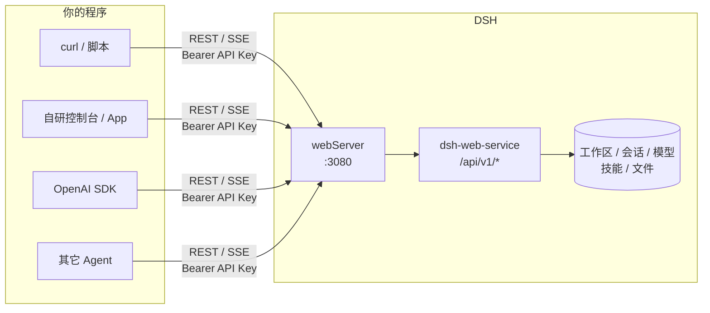
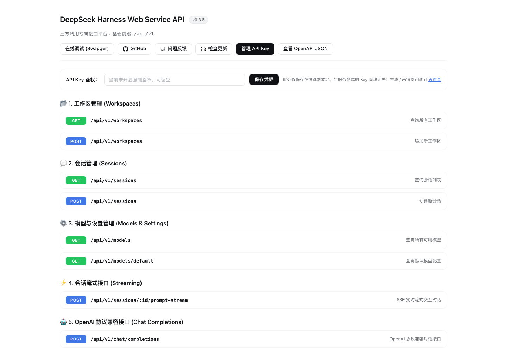
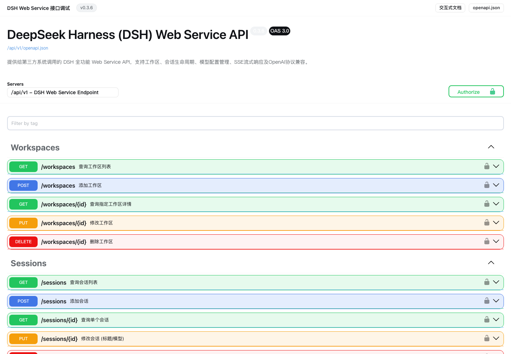
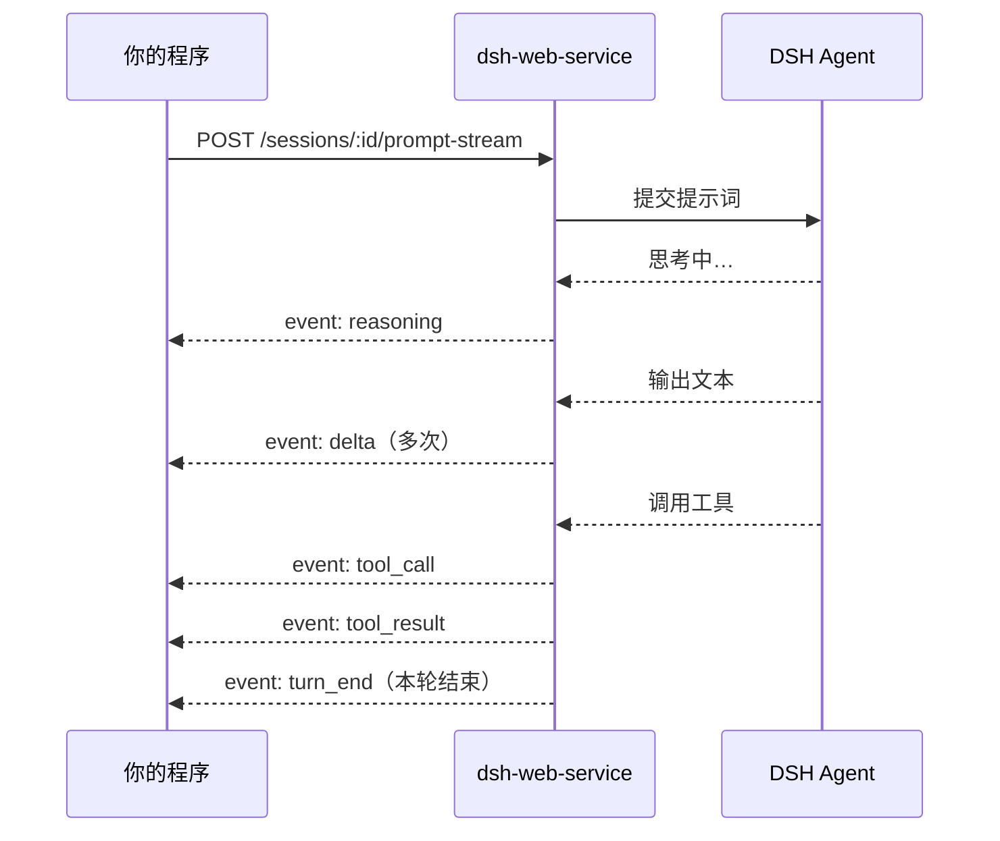
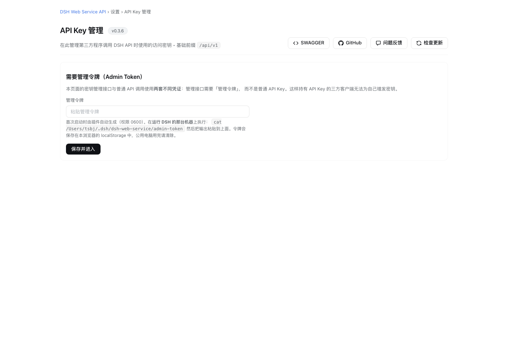
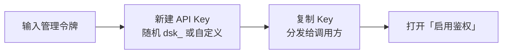

# dsh-web-service 使用教程

> 一句话：装上它，DSH 就多了一套 HTTP 接口。任何能发 HTTP 请求的程序（脚本、网页、App、其它 Agent、OpenAI SDK）都能驱动 DSH 干活。

## 1. 它能做什么



| 能力 | 典型接口 | 用来干嘛 |
|---|---|---|
| 工作区 | `/workspaces` | 增删改查项目目录 |
| 会话 | `/sessions` | 建会话、改标题/模型、看历史、看统计与任务清单 |
| 对话 | `/sessions/:id/prompt-stream`（SSE）、`/prompt`（同步） | 发提示词、实时收回复 |
| OpenAI 兼容 | `/chat/completions` | 现成 OpenAI 客户端改个 baseURL 就能用 |
| 交互 | `/questions`、`/answers`、`/cancel` | 回答 Agent 的提问、中止当前轮 |
| 文件 | `/sessions/:id/files` | 上传/浏览/下载工作区文件 |
| 模型与设置 | `/models`、`/providers`、`/settings` | 查模型、改默认模型 |
| 技能 | `/skills` | 管理 SKILL |
| 安全 | `/settings/api-keys` | 页面化管理 API Key |
| 文档 | `/docs`、`/docs/reference`、`/openapi.json` | 在线调试，所有接口可 Try it out |

所有接口统一返回：

```json
{ "ok": true, "data": { ... } }          // 成功
{ "ok": false, "error": "...", "code": "..." }  // 失败
```

## 2. 三分钟上手

### 第 1 步：安装

```bash
dsh plugin --profile web add \
  https://github.com/toddpan/dsh-webapi/releases/latest/download/dsh-web-service.tgz
```

带 HMR 的 profile 会立即生效，否则重启一下 DSH。

### 第 2 步：确认在跑

```bash
curl -s http://127.0.0.1:3080/api/v1/system/status
# {"ok":true,"data":{"name":"dsh-web-service","status":"running","prefix":"/api/v1",...}}
```

> 端口取决于 DSH 的 webServer。本教程用 `3080` 举例；如果你用的是 DSH Web GUI，端口就是 GUI 地址里的那个（例如 `19387`）。

### 第 3 步：打开在线文档

浏览器访问 `http://127.0.0.1:3080/api/v1/docs`：



想逐个接口点「Try it out」，进 `/docs/reference`（Swagger UI，资源随包自带，内网离线也能打开）：



### 第 4 步：发出第一句话

```bash
BASE=http://127.0.0.1:3080/api/v1

# 建会话（cwd 是 Agent 干活的目录）
SID=$(curl -s -X POST $BASE/sessions -H 'Content-Type: application/json' \
  -d '{"cwd":"/path/to/project","title":"第一次试用"}' | jq -r .data.id)

# 同步等结果
curl -s -X POST $BASE/sessions/$SID/prompt -H 'Content-Type: application/json' \
  -d '{"prompt":"列出当前目录的文件"}'
```

到这里就通了。下面按场景展开。

## 3. 实时流式对话（SSE）

`prompt-stream` 会边生成边推送事件，适合做聊天界面：

```bash
curl -N -X POST $BASE/sessions/$SID/prompt-stream -H 'Content-Type: application/json' \
  -d '{"prompt":"帮我写一个 hello world"}'
```



| 事件 | 数据 | 前端怎么处理 |
|---|---|---|
| `delta` | `{ delta, seq }` | 追加到回复气泡 |
| `reasoning` | `{ delta, seq }` | 显示在「思考过程」折叠区 |
| `tool_call` | `{ id, name, arguments }` | 展示「正在调用 xxx」 |
| `tool_result` | `{ id, ... }` | 展示工具输出 |
| `turn_end` | 本轮汇总 | 停止 loading |

其它常用操作：

```bash
curl -N $BASE/sessions/$SID/events                    # 旁路监听该会话的所有事件
curl -X POST $BASE/sessions/$SID/cancel               # 中止当前轮
curl $BASE/sessions/$SID/questions                    # Agent 用 ask_user_question 提问时，在这里取问题
curl -X POST $BASE/sessions/$SID/answers -H 'Content-Type: application/json' \
  -d '{"answers":[{"id":"q1","selected":["确认"]}]}'  # 回答后会话自动继续
```

## 4. 当成 OpenAI 来用

已有基于 OpenAI SDK 的代码，只需换 `baseURL`：

```python
from openai import OpenAI

client = OpenAI(base_url="http://127.0.0.1:3080/api/v1", api_key="dsk_xxx")  # 未开鉴权时随便填
resp = client.chat.completions.create(
    model="deepseek-official/deepseek-chat",   # 写成 provider/model；省略则用 DSH 默认模型
    messages=[{"role": "user", "content": "你好"}],
    stream=True,
)
for chunk in resp:
    print(chunk.choices[0].delta.content or "", end="")
```

可用的 `provider/model` 从 `GET /models` 查。请求体里可额外带 `sessionId` 续用已有会话，不带就自动建临时会话。

## 5. 文件进出

```bash
# 上传（可一次多个，同名自动加 -1 后缀）
curl -X POST $BASE/sessions/$SID/files -F file=@./需求.pdf -F file=@./data.csv

# 浏览 / 下载
curl "$BASE/sessions/$SID/files?path=."
curl -o out.zip "$BASE/sessions/$SID/files/download?path=dist/out.zip"
```

上传后 Agent 可以直接用文件工具读取。超大文件走分片续传接口 `/sessions/:id/files/resumable`。

## 6. 配置

所有配置都可选，不写就是默认值。写在 profile 装配层里插件行的 `config` 下：

```yaml
- id: dsh-web-service
  name: 'dsh-web-service'
  config:
    pathPrefix: /api/v1          # 路由前缀
    standalonePort: 0            # >0 时额外开一个独立端口（监听 0.0.0.0）
    cors: true                   # 允许跨域
    defaultCwd: ''               # 建会话不传 cwd 时的默认目录，空 = DSH 进程目录
    maxUploadBytes: 2147483648   # 上传上限，默认 2 GiB
    adminRemoteAccess: false     # 是否允许非本机管理 API Key
    apiKey: ''                   # 遗留单 Key，非空即强制开启鉴权（推荐改用设置页）
```

| 字段 | 默认 | 什么时候改 |
|---|---|---|
| `pathPrefix` | `/api/v1` | 和别的插件路由冲突，或要挂在网关子路径下 |
| `standalonePort` | `0` | 想让 API 与 GUI 分端口，比如单独对外暴露 `8787` |
| `cors` | `true` | 只给后端调用时可关掉 |
| `defaultCwd` | 空 | 三方调用通常不传 cwd，固定一个项目目录更省事 |
| `maxUploadBytes` | 2 GiB | 想限制上传体积 |
| `adminRemoteAccess` | `false` | 确实需要从别的机器管理密钥（务必配合网络层保护） |
| `apiKey` | 空 | 只为兼容老配置；新用法见下一节 |

> 注意：开 `standalonePort` 后接口会监听所有网卡。如果机器在公网或共享网络里，请先开启 API Key 鉴权。

## 7. API Key：给接口加把锁

默认不鉴权，只适合本机调试。要给别的程序或别的机器用，先开鉴权。

### 7.1 打开设置页

三个入口任选：DSH Web GUI 侧边栏「API Key 管理」、直接访问 `/api/v1/settings/api-keys`、或 `/docs` 页头的「管理 API Key」。



### 7.2 输入管理令牌

首次打开会要求「管理令牌」。它是插件首次启动时自动生成的，在运行 DSH 的机器上执行：

```bash
cat "${DSH_HOME:-$HOME/.dsh}/dsh-web-service/admin-token"
```

粘贴一次即可，浏览器会记住（公用电脑用完点「清除本机管理令牌」）。

### 7.3 新建 Key → 开启鉴权



开启后，调用方这样带上 Key：

```bash
curl -H "Authorization: Bearer dsk_xxx" $BASE/sessions
# 或
curl -H "X-API-Key: dsk_xxx" $BASE/sessions
```

### 7.4 两套凭证别混用

| 用途 | 凭证 | 谁持有 |
|---|---|---|
| 调业务接口 | API Key | 三方程序 |
| 管理密钥 | 管理令牌（admin-token） | 只有你 |

所以拿到 API Key 的程序没法给自己再发 Key。其它要点：

- 列表里随时可以「复制」已有 Key；磁盘上只存哈希和用管理令牌加密的密文。
- 「轮换」会让旧 Key 立即失效。更稳的做法：先新建一个替代 Key，调用方切过去后再吊销旧的。
- 没有任何有效 Key 时不允许开启鉴权，防止把自己锁在门外。
- 管理接口默认只允许本机访问。前面套了反向代理或隧道时，代理会被当成「本机」，请在网络层自行收口。

## 8. 让 DSH 里的 Agent 也会用

仓库自带一份 SKILL，装上后 Agent 能自己调用这套接口（比如让一个会话去指挥另一个会话）：

```bash
curl -fsSL https://raw.githubusercontent.com/toddpan/dsh-webapi/main/scripts/install-skill.sh | bash
```

装到 `~/.dsh/skills/dsh-web-service/`，无需重启，下个会话生效；会话里也可以用 `/dsh-web-service` 直接调起。

## 9. 常见问题

| 现象 | 原因与处理 |
|---|---|
| `/system/status` 连不上 | 端口不对：看 DSH webServer 的实际端口；或插件没加载，重启 DSH |
| 插件清单显示「未运行」 | 多半是包里缺 `lib/`，重装 tarball；失败条目不会自动重试，在插件管理器里关掉再打开 |
| 返回 `401` | 已开鉴权但没带 Key，或 Key 已吊销/过期 |
| 管理接口返回 `403 FORBIDDEN_ORIGIN` | 浏览器跨源调用了管理接口，请从同源页面操作 |
| 管理接口远程访问被拒 | 默认仅本机；确需远程开 `adminRemoteAccess: true` |
| `/system/status` 显示 `keysStoreDegraded` | 密钥文件损坏，插件已保留 `.corrupt-*` 并尝试从 `.bak` 恢复；期间鉴权不会被放松 |
| OpenAI 客户端报模型不存在 | `model` 要写成 `provider/model`，可选值看 `GET /models` |

---

更多细节：[README.zh.md](../README.zh.md)（完整路由表）、[INSTALL.md](../INSTALL.md)（手动挂载与排障）、在线 `/docs/reference`（每个接口的参数与示例）。
